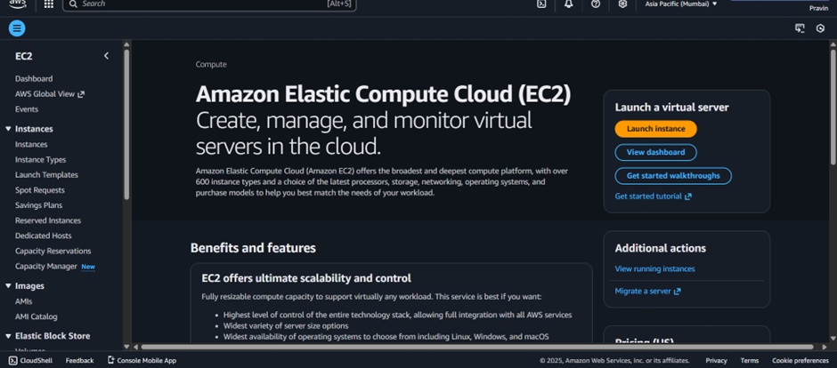
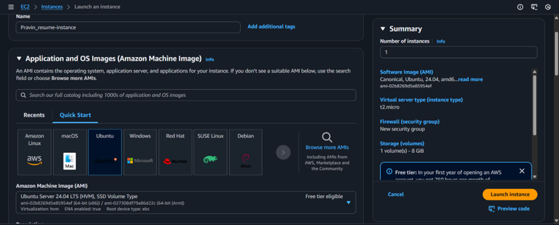
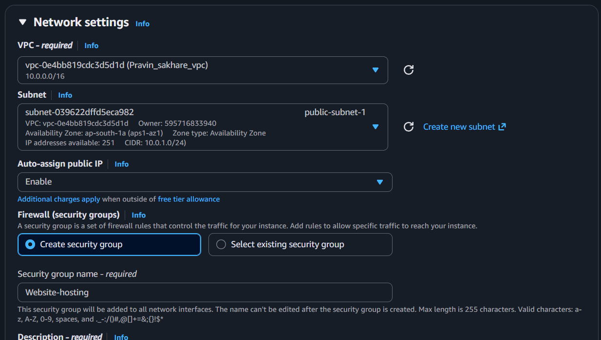
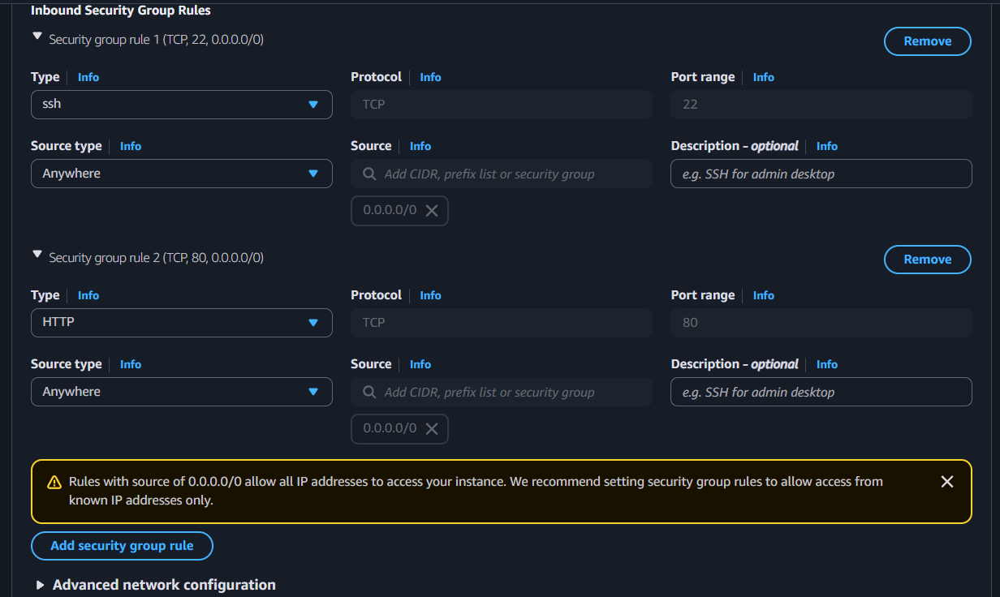
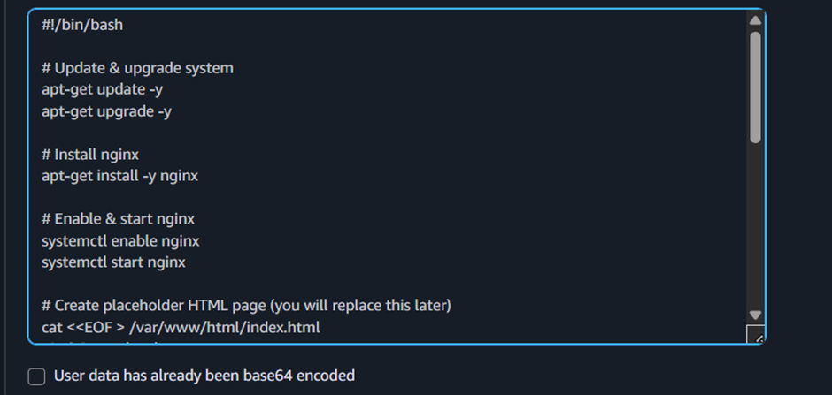
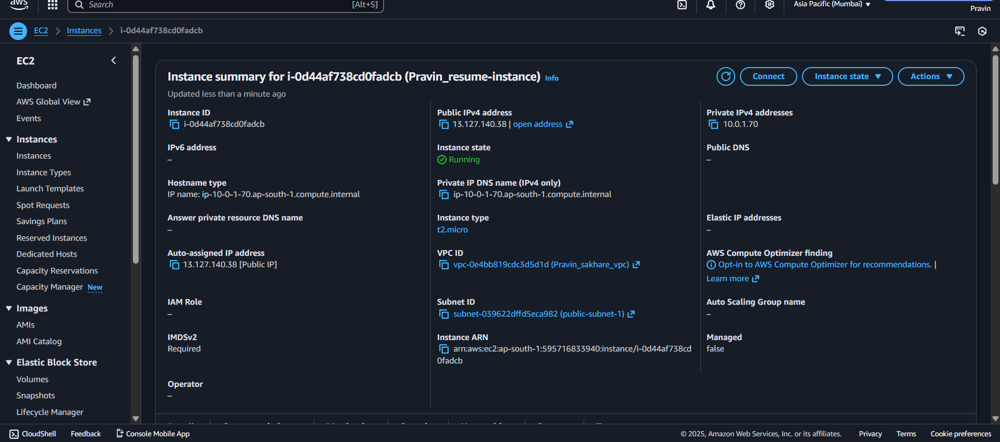
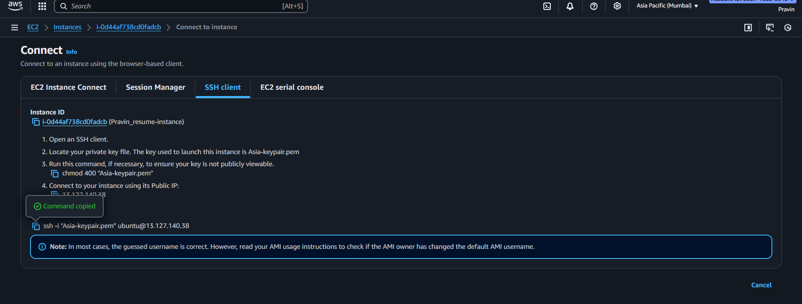
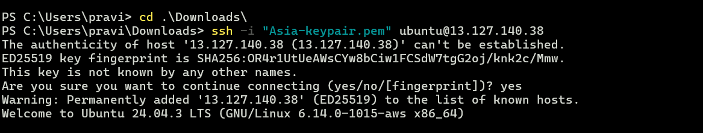
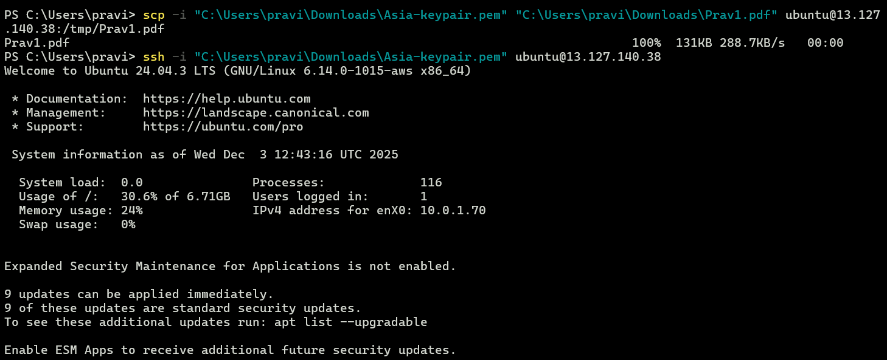
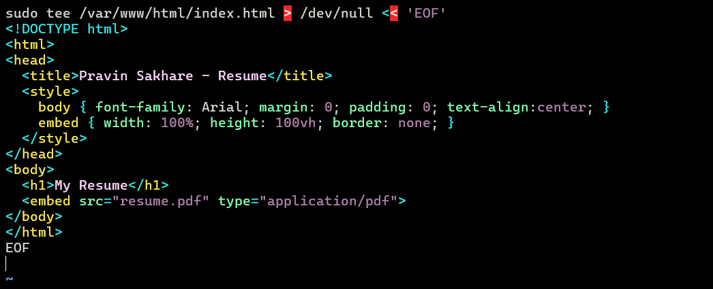

# Deploying a Resume Website on AWS EC2

This guide walks you through launching an EC2 instance and hosting your resume as a static website using Nginx.

## 📋 Prerequisites

- An active AWS account
- A resume PDF file ready to upload
- SSH client installed (OpenSSH for Windows PowerShell, or built-in terminal for Mac/Linux)
- A key pair for EC2 access (or ability to create one)
- A VPC with a public subnet configured

---

## 🎯 What You'll Build

By the end of this guide, you'll have:
- An Ubuntu EC2 instance running Nginx web server
- Your resume hosted and publicly accessible via HTTP
- A simple HTML page displaying your resume PDF

---

## 🚀 Step 1: Launch EC2 Instance

### 1.1 Basic Configuration

1. Navigate to **EC2 Dashboard** in AWS Console
2. Click **Launch Instance**



### 1.2 Name and AMI Selection

- **Name:** `Pravin_resume-instance` (or your preferred name)
- **AMI:** Select **Ubuntu Server** (latest LTS version recommended)


### 1.3 Instance Type

- Choose **t2.micro** (eligible for free tier)
- Or select based on your requirements


### 1.4 Key Pair Configuration

- Select an existing key pair **OR**
- Click **Create new key pair** if you don't have one
  - **Name:** Choose a meaningful name (e.g., `Asia-keypair`)
  - **Type:** RSA
  - **Format:** `.pem` for Mac/Linux, `.ppk` for PuTTY
- Download and **save the key pair securely** (you won't be able to download it again)



### 1.5 Network Settings

Configure your network settings:

- **VPC:** Select the VPC you created
- **Subnet:** Select **Public Subnet 1**
- **Auto-assign public IP:** Enable



### 1.6 Security Group Configuration

Create a new security group with the following inbound rules:

- **SSH (Port 22):** Source = Anywhere (or My IP for better security)
- **HTTP (Port 80):** Source = Anywhere

> **Security Note:** For production environments, restrict SSH access to your IP address only.



### 1.7 User Data Script

Expand **Advanced details** and add the following script in the **User data** field:

```bash
#!/bin/bash

# Update & upgrade system
apt-get update -y
apt-get upgrade -y

# Install nginx
apt-get install -y nginx

# Enable & start nginx
systemctl enable nginx
systemctl start nginx

# Create placeholder HTML page
cat <<EOF > /var/www/html/index.html
<!DOCTYPE html>
<html>
<head>
  <title>My Resume Website</title>
</head>
<body>
  <h1>Welcome to My Resume Website</h1>
  <p>Resume will be uploaded here soon.</p>
</body>
</html>
EOF

# Set correct permissions
chown www-data:www-data /var/www/html/index.html
chmod 644 /var/www/html/index.html

# Basic SSH hardening
sed -i 's/^#\?PermitRootLogin.*/PermitRootLogin no/' /etc/ssh/sshd_config
sed -i 's/^#\?PasswordAuthentication.*/PasswordAuthentication no/' /etc/ssh/sshd_config
systemctl restart sshd
```



### 1.8 Launch Instance

- Review your configuration
- Click **Launch Instance**
- Wait for the instance state to show **Running**



---

## 🔌 Step 2: Connect to Your EC2 Instance

### 2.1 Get Connection Information

1. Select your instance in the EC2 dashboard
2. Click **Connect**
3. Go to the **SSH client** tab to view connection instructions



### 2.2 Connect via SSH

1. Open your terminal (PowerShell on Windows, Terminal on Mac/Linux)
2. Navigate to the directory containing your `.pem` key file

```bash
cd Downloads
```



3. Set proper permissions on your key file (Mac/Linux only):

```bash
chmod 400 Asia-keypair.pem
```

4. Connect to your instance:

```bash
ssh -i "Asia-keypair.pem" ubuntu@<YOUR_PUBLIC_IP>
```

Replace `<YOUR_PUBLIC_IP>` with your instance's public IP address.

---

## 📄 Step 3: Upload Your Resume

### 3.1 Transfer Resume to EC2

Open a **new terminal/PowerShell window** (keep your SSH session open) and run:

**Windows PowerShell:**
```powershell
scp -i "C:\Users\YOUR_USERNAME\Downloads\Asia-keypair.pem" "C:\Users\YOUR_USERNAME\Downloads\YOUR_RESUME.pdf" ubuntu@<YOUR_PUBLIC_IP>:/tmp/resume.pdf
```

**Mac/Linux:**
```bash
scp -i ~/Downloads/Asia-keypair.pem ~/Downloads/YOUR_RESUME.pdf ubuntu@<YOUR_PUBLIC_IP>:/tmp/resume.pdf
```



> **Note:** Replace the paths with your actual file locations and IP address.

### 3.2 Move Resume to Web Directory

Return to your SSH session and execute:

```bash
sudo mv /tmp/resume.pdf /var/www/html/resume.pdf
```

### 3.3 Set Proper Permissions

```bash
sudo chown www-data:www-data /var/www/html/resume.pdf
sudo chmod 644 /var/www/html/resume.pdf
```


---

## 🌐 Step 4: Update Website HTML

Create a new `index.html` file that displays your resume:

```bash
sudo tee /var/www/html/index.html > /dev/null << 'EOF'
<!DOCTYPE html>
<html>
<head>
  <title>Pravin Sakhare - Resume</title>
  <meta name="viewport" content="width=device-width, initial-scale=1.0">
  <style>
    body { 
      font-family: Arial, sans-serif; 
      margin: 0; 
      padding: 0; 
      text-align: center;
      background-color: #f4f4f4;
    }
    h1 {
      background-color: #333;
      color: white;
      padding: 20px;
      margin: 0;
    }
    embed { 
      width: 100%; 
      height: calc(100vh - 80px);
      border: none;
      box-shadow: 0 2px 10px rgba(0,0,0,0.1);
    }
  </style>
</head>
<body>
  <h1>My Resume</h1>
  <embed src="resume.pdf" type="application/pdf">
  <p style="padding: 10px;">
    If the PDF doesn't display, <a href="resume.pdf" download>click here to download</a>
  </p>
</body>
</html>
EOF
```



### 4.1 Restart Nginx

Apply the changes:

```bash
sudo systemctl restart nginx
```

---

## ✅ Step 5: Access Your Website

Your resume website is now live! Access it by:

1. Opening your browser
2. Navigating to: `http://<YOUR_PUBLIC_IP>`


> **Note:** Use `http://` not `https://` (port 80, not 443). The `/80` in the URL is not needed - browsers use port 80 by default for HTTP.

**Example:** `http://13.127.140.38`

---

## 🔧 Troubleshooting

### Website Not Loading?

**Check Security Group:**
- Ensure port 80 is open in your security group
- Verify "Anywhere" (0.0.0.0/0) is allowed for HTTP

**Check Nginx Status:**
```bash
sudo systemctl status nginx
```

**Check Nginx Error Logs:**
```bash
sudo tail -f /var/log/nginx/error.log
```

### PDF Not Displaying?

**Verify File Exists:**
```bash
ls -la /var/www/html/resume.pdf
```

**Check Permissions:**
```bash
sudo chmod 644 /var/www/html/resume.pdf
sudo chown www-data:www-data /var/www/html/resume.pdf
```

### Can't Connect via SSH?

- Verify your key pair file permissions (should be 400 or 600)
- Check that port 22 is open in your security group
- Ensure you're using the correct public IP address
- Confirm the instance is in "running" state

---

## 🛡️ Security Best Practices

1. **Restrict SSH Access:** Update security group to allow SSH only from your IP
2. **Use HTTPS:** Consider setting up SSL/TLS with Let's Encrypt (for production)
3. **Keep System Updated:** Regularly run `sudo apt update && sudo apt upgrade`
4. **Enable Firewall:** Configure UFW (Uncomplicated Firewall) on Ubuntu
5. **Monitor Access Logs:** Check `/var/log/nginx/access.log` regularly
6. **Backup Key Pair:** Store your `.pem` file securely and create backups

---

## 📈 Next Steps

- **Custom Domain:** Point a domain name to your EC2 instance using Route 53
- **HTTPS Setup:** Install SSL certificate using Certbot and Let's Encrypt
- **Enhanced Design:** Improve your website with custom CSS and branding
- **Auto-scaling:** Set up load balancers and auto-scaling groups for production
- **Monitoring:** Configure CloudWatch alarms for instance health

---

## 📚 Additional Resources

- [AWS EC2 Documentation](https://docs.aws.amazon.com/ec2/)
- [Nginx Documentation](https://nginx.org/en/docs/)
- [Ubuntu Server Guide](https://ubuntu.com/server/docs)
- [Let's Encrypt SSL Setup](https://letsencrypt.org/getting-started/)

---

## 💡 Tips

- **Save your public IP:** Your EC2 public IP may change if you stop/start the instance. Consider using an Elastic IP for a static address.
- **Cost Management:** Stop your instance when not in use to save costs (with t2.micro free tier)
- **Update Resume:** To update your resume, simply repeat Step 3 with your new PDF file
- **Test Before Deploying:** Always test changes locally when possible

---

**🎉 Congratulations!** You've successfully deployed your resume website on AWS EC2!