# High Availability + Auto Scaling Architecture on AWS

This guide demonstrates how to migrate from a single EC2 instance to a highly available, auto-scaling architecture using Application Load Balancer (ALB) and Auto Scaling Groups (ASG).

## 📋 Architecture Overview

### What You'll Build

A production-grade, highly available architecture with:

- **Application Load Balancer (ALB)** - Internet-facing, distributes traffic across instances
- **Auto Scaling Group (ASG)** - Automatically maintains 2-4 EC2 instances across multiple Availability Zones
- **Private Subnets** - EC2 instances isolated from direct internet access
- **S3 Integration** - Resume stored centrally and downloaded by instances automatically
- **IAM Roles** - Secure access to AWS resources without hardcoded credentials
- **Session Manager** - SSH-free instance access via AWS Systems Manager

### Traffic Flow

```
Internet Users
    ↓
Application Load Balancer (Public Subnets)
    ↓
Target Group
    ↓
EC2 Instances (Private Subnets across 2 AZs)
    ↓
S3 Bucket (Resume PDF)
```

### Benefits

- **High Availability:** Multi-AZ deployment survives AZ failures
- **Auto Scaling:** Handles traffic spikes automatically
- **Security:** Instances in private subnets, no SSH keys needed
- **Reliability:** Load balancer performs health checks
- **Cost Optimization:** Scales down during low traffic

---

## 🎯 Prerequisites

Before starting, ensure you have:

- ✅ A VPC with **2 public subnets** and **2 private subnets** across different AZs
- ✅ Internet Gateway attached to VPC
- ✅ NAT Gateway in public subnet (for private subnet internet access)
- ✅ Route tables configured properly
- ✅ Your resume PDF file ready
- ✅ Basic understanding of AWS networking

---

## 🗂️ Step 1: Upload Resume to S3

### Why S3?

Storing your resume in S3 allows all Auto Scaling instances to automatically download it on boot without manual file transfers.

### 1.1 Create S3 Bucket

1. Navigate to **S3** in AWS Console
2. Click **Create bucket**

**Bucket Configuration:**
- **Bucket name:** `pravin-sakhare-resume-bucket` (must be globally unique)
- **Region:** Same as your EC2 instances

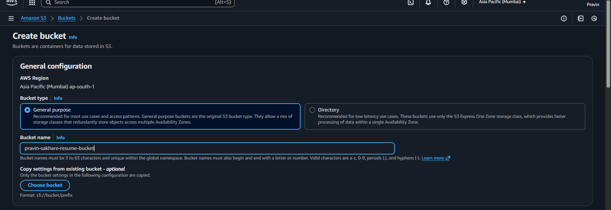

### 1.2 Block Public Access

Keep the default settings:
- ✅ **Block all public access** - Keep this ENABLED for security

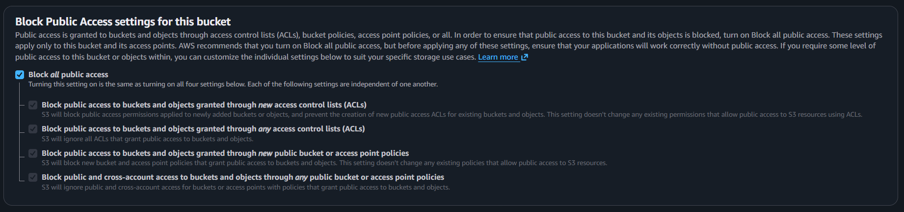

> **Security Note:** The bucket stays private. EC2 instances access it via IAM roles, not public URLs.

### 1.3 Upload Resume

1. Open your newly created bucket
2. Click **Upload**
3. Select your resume PDF (e.g., `Prav1.pdf`)
4. Click **Upload**

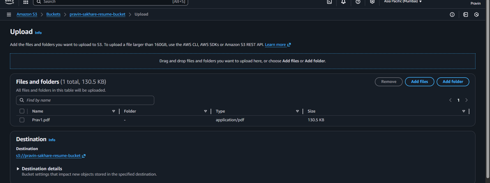

**Note the exact filename** - you'll need it in the user data script later.

---

## 🔐 Step 2: Create IAM Role for EC2

### Purpose

This IAM role grants EC2 instances permission to:
- Read your resume from S3
- Connect via AWS Systems Manager (Session Manager) without SSH

### 2.1 Create Role

1. Go to **IAM** → **Roles** → **Create role**


2. **Trusted entity type:** AWS service
3. **Use case:** EC2
4. Click **Next**

### 2.2 Attach Managed Policy

Search for and attach:
- **AmazonSSMManagedInstanceCore**

This enables Session Manager access.


### 2.3 Name the Role

- **Role name:** `Pravin-InstanceRole`
- **Description:** `Allows EC2 to access S3 resume and use Session Manager`

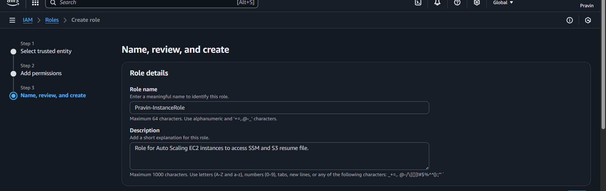

Click **Create role**

### 2.4 Add S3 Access Policy

1. Open your newly created role: `Pravin-InstanceRole`
2. Go to **Permissions** tab
3. Click **Add permissions** → **Create inline policy**

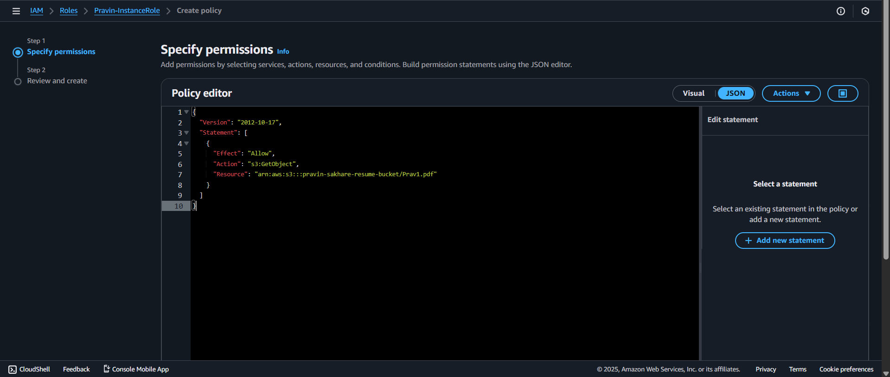

4. Select **JSON** editor and paste:

```json
{
  "Version": "2012-10-17",
  "Statement": [
    {
      "Effect": "Allow",
      "Action": "s3:GetObject",
      "Resource": "arn:aws:s3:::pravin-sakhare-resume-bucket/Prav1.pdf"
    }
  ]
}
```

> **Important:** Replace the bucket name and filename with your actual values.

5. **Policy name:** `S3ResumeReadAccess`
6. Click **Create policy**

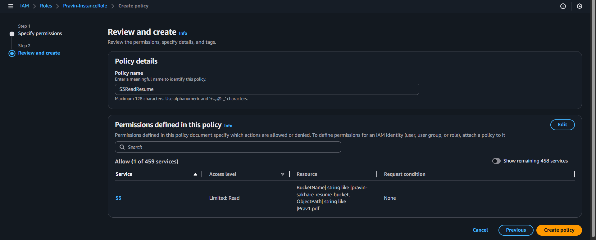

---

## 🎯 Step 3: Create Target Group

### What is a Target Group?

A Target Group defines where the ALB forwards traffic (your EC2 instances). It also performs health checks.

### 3.1 Navigate to Target Groups

1. Go to **EC2** → **Target Groups**
2. Click **Create target group**

### 3.2 Configure Target Group

**Basic configuration:**
- **Target type:** Instances
- **Target group name:** `Pravin-TG`
- **Protocol:** HTTP
- **Port:** 80
- **VPC:** Select your VPC

**Health checks:**
- **Health check path:** `/`
- **Health check protocol:** HTTP
- **Healthy threshold:** 2
- **Unhealthy threshold:** 2
- **Timeout:** 5 seconds
- **Interval:** 30 seconds

### 3.3 Register Targets

**IMPORTANT: Skip this step!**

❌ **DO NOT** manually add instances
✅ Auto Scaling Group will register instances automatically

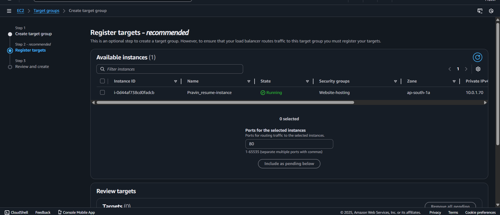

Click **Create target group**


---

## ⚖️ Step 4: Create Application Load Balancer

### 4.1 Start ALB Creation

1. Go to **EC2** → **Load Balancers**
2. Click **Create load balancer**


3. Select **Application Load Balancer**
4. Click **Create**

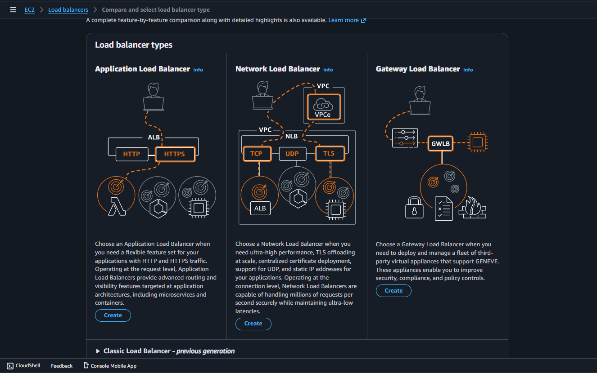

### 4.2 Basic Configuration

**Load balancer name:** `Pravin-ALB`
**Scheme:** Internet-facing
**IP address type:** IPv4

### 4.3 Network Mapping

**VPC:** Select your VPC

**Availability Zones:** Select **both public subnets**
- Public Subnet 1 (e.g., us-east-1a)
- Public Subnet 2 (e.g., us-east-1b)

> **Why public subnets?** The ALB needs to be internet-accessible to receive user traffic.

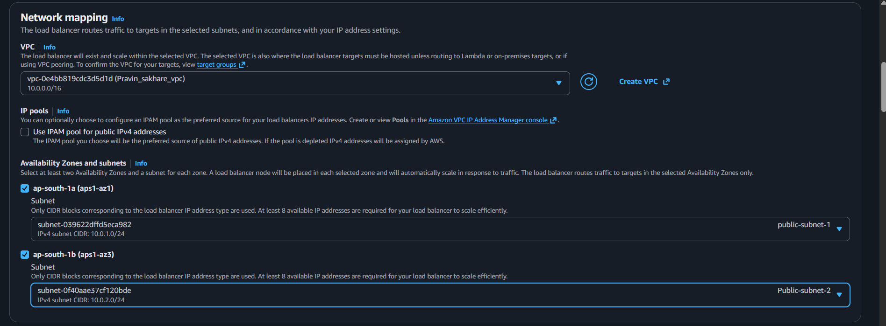

### 4.4 Security Group

Create or select a security group with:

**Inbound rules:**
- HTTP (80) from Anywhere (0.0.0.0/0)
- HTTPS (443) from Anywhere (optional, for future SSL)

### 4.5 Listeners and Routing

Default listener should be:
- **Protocol:** HTTP
- **Port:** 80
- **Default action:** Forward to `Pravin-TG`

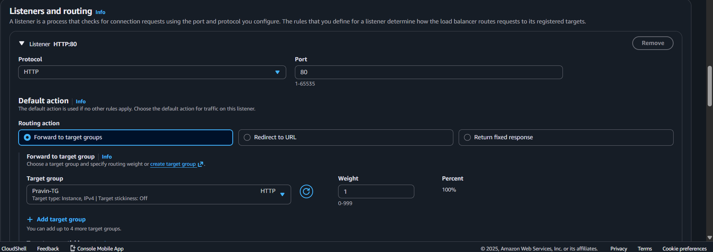

### 4.6 Create Load Balancer

Click **Create load balancer**

Wait for status to change from **provisioning** → **active** (~2-3 minutes)


**Copy the ALB DNS name** - you'll use this to access your website.

---

## 🚀 Step 5: Create Launch Template

### What is a Launch Template?

A Launch Template defines the configuration for EC2 instances that the Auto Scaling Group will launch.

### 5.1 Start Creation

1. Go to **EC2** → **Launch Templates**
2. Click **Create launch template**

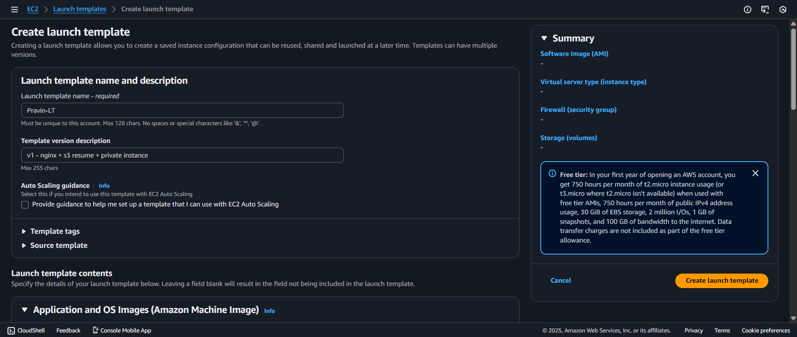

### 5.2 Template Details

**Launch template name:** `Pravin-LT`
**Description:** `Template for resume website with auto-scaling`

### 5.3 AMI Selection

- **AMI:** Ubuntu Server 22.04 LTS (or latest)

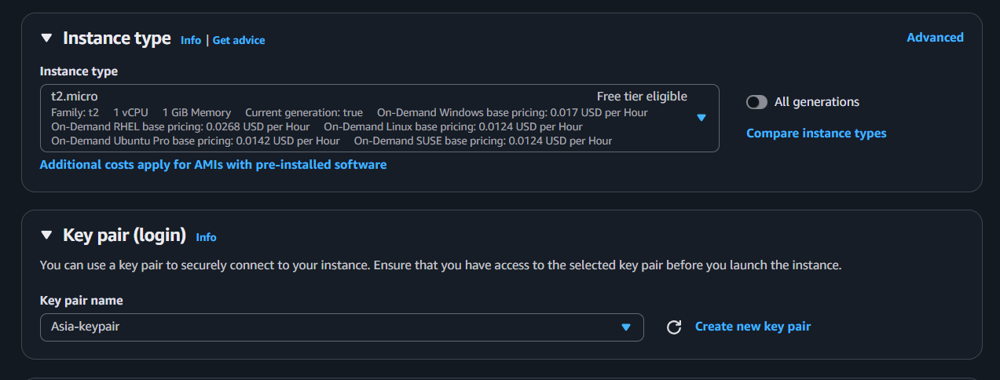

### 5.4 Instance Type and Key Pair

- **Instance type:** `t2.micro` (free tier eligible)
- **Key pair:** Select existing or create new (optional with Session Manager)

### 5.5 IAM Instance Profile

Scroll to **Advanced details**

Find **IAM instance profile** and select:
- `Pravin-InstanceRole`


### 5.6 Security Group

Create or select a security group for instances with:

**Inbound rules:**
- HTTP (80) from ALB security group only
- (Session Manager doesn't require SSH inbound rule)

### 5.7 User Data Script

In **Advanced details**, add this script in **User data**:

```bash
#!/bin/bash
set -euo pipefail

# Update system
apt-get update -y
DEBIAN_FRONTEND=noninteractive apt-get -y upgrade

# Install required packages
apt-get install -y nginx awscli

# Enable and start Nginx
systemctl enable nginx
systemctl start nginx

# Download resume from S3 (IAM role grants access)
aws s3 cp s3://pravin-sakhare-resume-bucket/Prav1.pdf /var/www/html/resume.pdf || true

# Create index.html embedding PDF
cat > /var/www/html/index.html <<'EOF'
<!DOCTYPE html>
<html>
<head>
  <meta charset="utf-8">
  <meta name="viewport" content="width=device-width, initial-scale=1.0">
  <title>Pravin Sakhare - Resume</title>
  <style>
    body { 
      margin: 0; 
      font-family: Arial, sans-serif;
      background-color: #f4f4f4;
    }
    h1 { 
      text-align: center; 
      background-color: #333;
      color: white;
      padding: 20px;
      margin: 0;
    }
    .container { 
      height: 90vh; 
      padding: 0;
    }
    embed { 
      width: 100%; 
      height: 100%;
      border: none;
    }
  </style>
</head>
<body>
  <h1>Pravin Sakhare — Resume</h1>
  <div class="container">
    <embed src="resume.pdf" type="application/pdf">
  </div>
</body>
</html>
EOF

# Set proper permissions
chown -R www-data:www-data /var/www/html
chmod 644 /var/www/html/resume.pdf || true
```

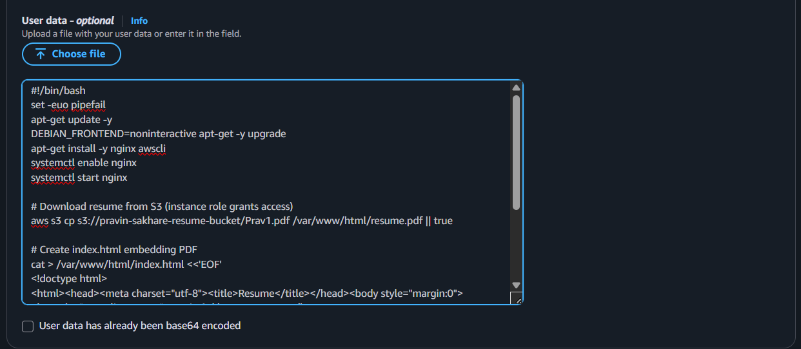

> **Critical:** Update bucket name and filename to match your S3 bucket!

### 5.8 Create Template

Click **Create launch template**


---

## 📊 Step 6: Create Auto Scaling Group

### What is an Auto Scaling Group?

ASG automatically launches and maintains a specified number of EC2 instances across multiple Availability Zones for high availability.

### 6.1 Start ASG Creation

1. Go to **EC2** → **Auto Scaling Groups**
2. Click **Create Auto Scaling group**


### 6.2 Choose Launch Template

**Auto Scaling group name:** `Pravin-ASG`

**Launch template:** Select `Pravin-LT`

Click **Next**

### 6.3 Network Configuration

**VPC:** Select your VPC

**Availability Zones and subnets:** Select **ONLY private subnets**
- Private Subnet 1 (e.g., us-east-1a)
- Private Subnet 2 (e.g., us-east-1b)

> **Why private subnets?** For security - instances don't need direct internet access.


Click **Next**

### 6.4 Attach Load Balancer

**Load balancing:** Choose **Attach to an existing load balancer**

**Existing load balancer target groups:** Select `Pravin-TG`

**Health checks:**
- ✅ ELB health checks (recommended)
- Health check grace period: 300 seconds

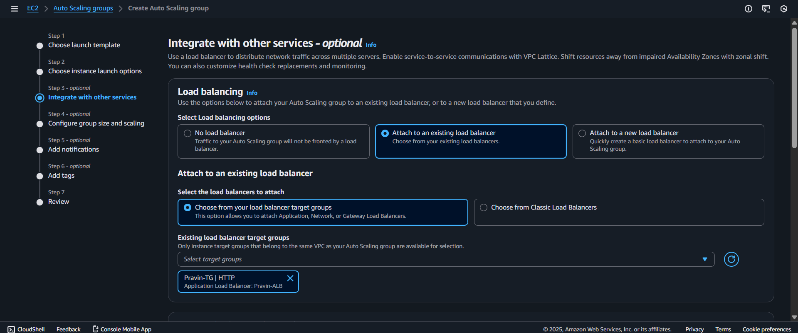

Click **Next**

### 6.5 Group Size and Scaling Policies

**Desired capacity:** 2
**Minimum capacity:** 2
**Maximum capacity:** 4

**Scaling policies:** None (or configure target tracking if desired)


**Why these numbers?**
- **Minimum 2:** Ensures high availability across 2 AZs
- **Desired 2:** Normal operating state
- **Maximum 4:** Can scale up during high traffic

Click **Next**

### 6.6 Add Tags

Add a tag for easy identification:
- **Key:** `Name`
- **Value:** `Pravin-ASG-Instance`


Click **Next**, then **Create Auto Scaling group**

### 6.7 Verify ASG Creation

Your ASG is now active!


Wait 2-3 minutes for instances to launch and pass health checks.


---

## ✅ Step 7: Verify Deployment

### 7.1 Check Target Group Health

1. Go to **EC2** → **Target Groups** → `Pravin-TG`
2. Click **Targets** tab
3. Wait until both instances show **healthy** status

### 7.2 Check ALB Status

1. Go to **EC2** → **Load Balancers** → `Pravin-ALB`
2. Ensure status is **active**
3. Copy the **DNS name**

### 7.3 Access Your Website

Open a browser and navigate to:
```
http://[YOUR-ALB-DNS-NAME]
```

Example: `http://pravin-alb-123456789.us-east-1.elb.amazonaws.com`

🎉 **Your resume should now be displayed!**

### 7.4 Test High Availability

Try these tests:

**Test 1 - Refresh multiple times:** Traffic should distribute across instances

**Test 2 - Terminate one instance:** ASG will automatically launch a replacement

**Test 3 - Update resume:** Upload new PDF to S3, terminate instances, ASG launches new ones with updated resume

---

## 🔍 Architecture Explanation

### Traffic Flow Details

1. **User Request**
   - User visits ALB DNS name on port 80
   
2. **Load Balancer**
   - ALB receives request in public subnet
   - Checks target group health
   - Routes to healthy instance using round-robin

3. **Target Group**
   - Maintains list of registered instances
   - Performs health checks every 30 seconds
   - Removes unhealthy instances from rotation

4. **EC2 Instances**
   - Located in private subnets across 2 AZs
   - Run Nginx web server on port 80
   - Download resume from S3 on boot via IAM role
   - Serve HTML page with embedded PDF

5. **S3 Integration**
   - Central resume storage
   - Accessed via AWS CLI with IAM credentials
   - No public access required

### High Availability Benefits

- **Multi-AZ Deployment:** If one AZ fails, instances in other AZ continue serving traffic
- **Auto-Recovery:** ASG replaces failed instances automatically
- **Load Distribution:** ALB spreads traffic evenly across healthy instances
- **Health Monitoring:** Unhealthy instances are removed from rotation
- **Zero Downtime Updates:** Can update instances rolling fashion

---

## 🔧 Troubleshooting

### Targets Show Unhealthy

**Check Security Groups:**
- Instance security group must allow HTTP (80) from ALB security group
- Verify both inbound and outbound rules

**Check User Data Script:**
```bash
# Connect via Session Manager
aws ssm start-session --target i-xxxxx

# Check Nginx status
sudo systemctl status nginx

# Check if resume was downloaded
ls -la /var/www/html/resume.pdf

# Check Nginx logs
sudo tail -f /var/log/nginx/error.log
```

**Check Health Check Settings:**
- Path should be `/`
- Timeout: 5 seconds
- Interval: 30 seconds
- Healthy threshold: 2

### ALB Returns 503 Error

- No healthy targets in target group
- All instances might be failing health checks
- Check instance security group rules
- Verify Nginx is running on instances

### Resume Not Displaying

**Check S3 Access:**
- Verify IAM role has correct S3 policy
- Confirm bucket name and filename in user data script
- Check instance IAM role attachment

**Verify Download:**
```bash
# From Session Manager
aws s3 ls s3://pravin-sakhare-resume-bucket/
sudo cat /var/log/cloud-init-output.log | grep "s3 cp"
```

### Instances Not Launching

**Check Launch Template:**
- Verify AMI is available in your region
- Confirm IAM instance profile exists
- Check user data script for syntax errors

**Check ASG:**
- Verify subnet IDs are correct
- Ensure NAT Gateway is configured for private subnets
- Check service quotas (EC2 instance limits)

### Can't Connect to Instance

Use Session Manager instead of SSH:
```bash
aws ssm start-session --target i-xxxxxxxxxxxxx
```

No SSH key pair needed!

---

## 🛡️ Security Best Practices

### Network Security

✅ **DO:**
- Keep EC2 instances in private subnets
- Allow ALB to instance traffic only
- Use security group references instead of IP ranges
- Enable VPC Flow Logs for monitoring

❌ **DON'T:**
- Don't expose instances directly to internet
- Don't allow SSH from 0.0.0.0/0
- Don't use same security group for ALB and instances

### IAM Security

✅ **DO:**
- Use IAM roles instead of access keys
- Follow principle of least privilege
- Limit S3 policy to specific object
- Enable CloudTrail for audit logs

❌ **DON'T:**
- Don't hardcode credentials in user data
- Don't give full S3 access when only GetObject needed
- Don't share IAM roles across unrelated applications

### Application Security

✅ **DO:**
- Keep system packages updated
- Enable SSL/TLS (HTTPS) for production
- Implement Web Application Firewall (WAF)
- Use AWS Certificate Manager for SSL

❌ **DON'T:**
- Don't use HTTP in production (use HTTPS)
- Don't skip security group configuration
- Don't ignore CloudWatch alarms

---

## 💰 Cost Optimization

### Current Setup Costs (Approximate)

**Monthly estimates for us-east-1:**
- **ALB:** ~$16-18/month (720 hours)
- **2 × t2.micro:** Free tier eligible (or ~$8-9/month)
- **S3:** <$1/month (storage + requests)
- **Data Transfer:** Minimal for resume website
- **NAT Gateway:** ~$32-35/month

**Total:** ~$50-60/month (without free tier)

### Cost Saving Tips

1. **Use t4g instances** (ARM-based) for better price-performance
2. **Stop development environments** when not in use
3. **Use S3 Intelligent-Tiering** for resume storage
4. **Implement ALB access logs** to S3 (analyze and optimize)
5. **Consider AWS Savings Plans** for predictable workloads
6. **Set up billing alarms** (refer to billing alerts guide)

---

## 📈 Next Steps

### Immediate Improvements

- [ ] **Enable HTTPS:** Use AWS Certificate Manager + Route 53
- [ ] **Custom Domain:** Point your domain to ALB
- [ ] **CloudWatch Alarms:** Monitor ALB latency and target health
- [ ] **S3 Versioning:** Enable for resume backup

### Advanced Enhancements

- [ ] **Auto Scaling Policies:** Add target tracking (CPU > 70%)
- [ ] **Multi-Region:** Deploy in multiple regions for global availability
- [ ] **WAF Integration:** Protect against common web attacks
- [ ] **CloudFront CDN:** Improve performance globally
- [ ] **Infrastructure as Code:** Convert to Terraform/CloudFormation

### Monitoring & Observability

- [ ] **CloudWatch Dashboards:** Create custom metrics dashboard
- [ ] **ALB Access Logs:** Enable and analyze with Athena
- [ ] **X-Ray Tracing:** Implement distributed tracing
- [ ] **SNS Notifications:** Alert on ASG events

---

## 📚 Additional Resources

### AWS Documentation
- [Application Load Balancer Guide](https://docs.aws.amazon.com/elasticloadbalancing/latest/application/)
- [Auto Scaling Documentation](https://docs.aws.amazon.com/autoscaling/)
- [EC2 User Data Scripts](https://docs.aws.amazon.com/AWSEC2/latest/UserGuide/user-data.html)
- [IAM Best Practices](https://docs.aws.amazon.com/IAM/latest/UserGuide/best-practices.html)

### Infrastructure as Code Examples
- [Terraform AWS ALB Module](https://registry.terraform.io/modules/terraform-aws-modules/alb/aws/)
- [CloudFormation ASG Examples](https://docs.aws.amazon.com/AWSCloudFormation/latest/UserGuide/aws-properties-as-group.html)

### Tools & Utilities
- [AWS CLI Reference](https://docs.aws.amazon.com/cli/)
- [Session Manager Plugin](https://docs.aws.amazon.com/systems-manager/latest/userguide/session-manager-working-with-install-plugin.html)
- [AWS Well-Architected Tool](https://aws.amazon.com/well-architected-tool/)

---

## 📝 Summary

You've successfully built a production-grade, highly available architecture! 

**What you've achieved:**
- ✅ Multi-AZ deployment for fault tolerance
- ✅ Auto-scaling to handle traffic variations
- ✅ Load balancing for even traffic distribution
- ✅ Secure private subnet architecture
- ✅ IAM-based authentication (no hardcoded credentials)
- ✅ Automated instance configuration via user data
- ✅ Health monitoring and auto-recovery

**Key metrics:**
- **Availability:** 99.9%+ (multi-AZ)
- **Recovery Time:** < 5 minutes (ASG auto-recovery)
- **Scalability:** 2-4 instances based on demand
- **Security:** Private subnets + IAM roles

---

**🎉 Congratulations!** You're now running a highly available, production-ready web application on AWS!