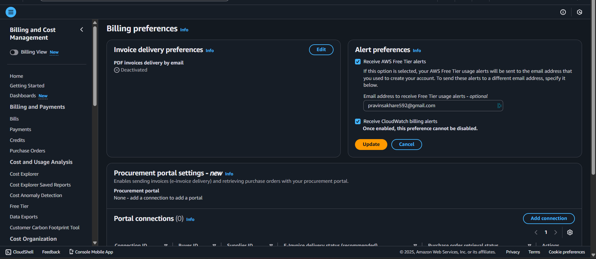
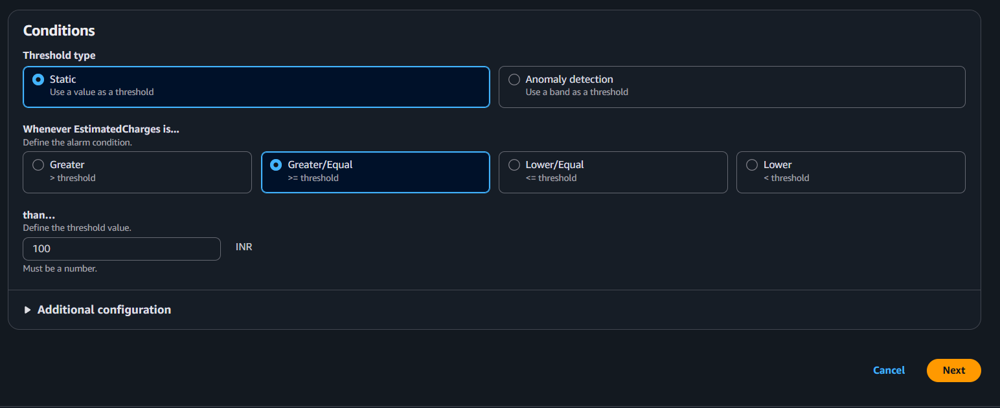
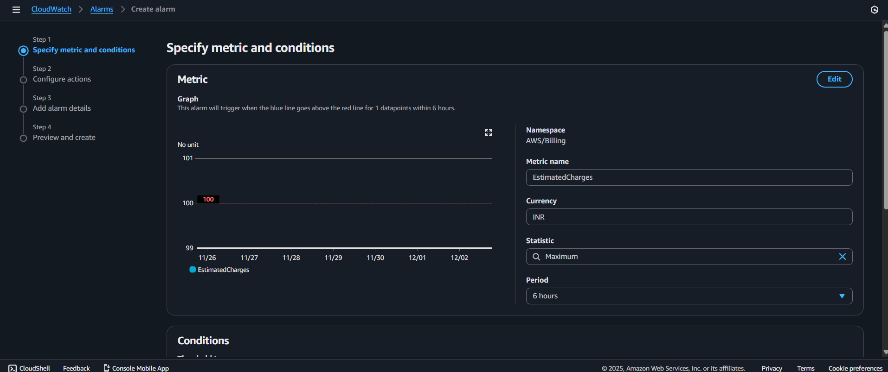
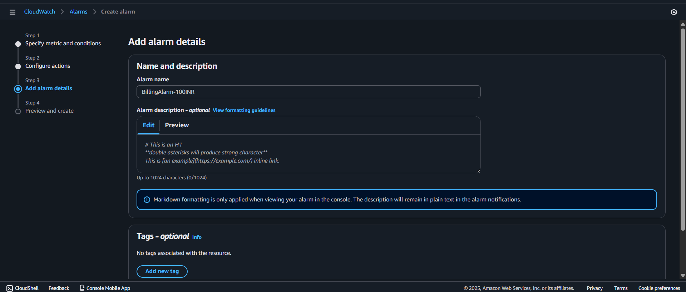
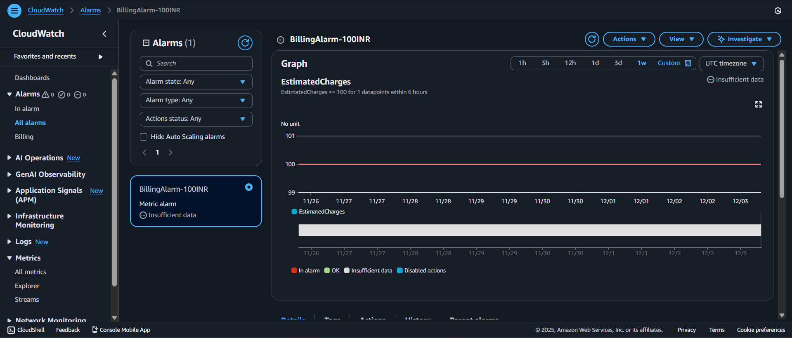

# AWS Billing Alerts Setup Guide

This guide walks you through setting up billing alerts in AWS to monitor your spending and avoid unexpected charges.

## Prerequisites

- An active AWS account
- Access to AWS Management Console
- A valid email address for receiving alerts

---

## 📋 Overview

Setting up billing alerts involves two main steps:
1. **Enable billing alerts globally** in your AWS account settings
2. **Create a CloudWatch alarm** to monitor your spending threshold

---

## ✅ Step 1: Enable Billing Alerts (Global Setting)

> **Note:** Billing alerts are **NOT enabled by default**, so this step is essential.

### Instructions

1. **Navigate to Billing Dashboard**
   - Go to [AWS Console](https://console.aws.amazon.com/)
   - Click your account name in the top-right corner
   - Select **Billing Dashboard**

2. **Configure Billing Preferences**
   - From the left menu, click **Billing preferences**
   - Enable the following options:
     - ✔ Receive CloudWatch billing alerts
     - ✔ Receive Free Tier usage alerts
     - ✔ Receive text/email alerts for bills
   - Enter your email address
   - Click **Save preferences**

---

## ✅ Step 2: Create a CloudWatch Billing Alarm

> **Important:** Billing alarms only work in the **US East (N. Virginia) - us-east-1** region. Ensure you set CloudWatch to this region before proceeding.

### 1. Access CloudWatch

- Open **AWS Console** → **Services** → **CloudWatch**
- In the top-right corner, verify/set region to **N. Virginia (us-east-1)**

### 2. Navigate to Billing Metrics

- From the left menu, select **Metrics**
- Click **Billing**
- Select **Total Estimated Charge**

### 3. Select Your Currency

- Choose the metric: **EstimatedCharges**
- Set dimension: **Currency = INR**

### 4. Create the Alarm

- Click **Actions** → **Create Alarm**

### 5. Configure Threshold

Set the following alarm conditions:

- **Threshold type:** Static
- **Condition:** Greater than or equal to
- **Value:** `100` (₹100 INR)

### 6. Set Up Notifications

Configure how you'll be notified when the alarm triggers:

- **Notification type:** Email
- **Create SNS topic** (if you haven't already):
  - **Topic name:** `BillingAlarmTopic`
  - **Email endpoint:** Enter your email address

### 7. Name Your Alarm

Give your alarm a descriptive name, such as:
- `Billing-Alert-100-INR`

### 8. Create the Alarm

- Review your settings
- Click **Create alarm**

---

## ✅ Verification

After successfully creating the alarm, you should see:

### Confirm Email Subscription

Check your email inbox for an SNS subscription confirmation from AWS. You **must confirm** this subscription to receive billing alerts.

---

## 🎯 What Happens Next?

Once set up:
- AWS will monitor your estimated charges in real-time
- When your spending reaches or exceeds ₹100 INR, you'll receive an email notification
- You can view alarm status anytime in the CloudWatch dashboard

---

## 💡 Best Practices

- **Set multiple alarms** at different thresholds (e.g., ₹50, ₹100, ₹200) for tiered warnings
- **Review your billing dashboard** regularly, even with alarms enabled
- **Enable Free Tier alerts** to avoid unexpected charges when free tier limits expire
- **Consider creating alarms for specific services** if you're heavily using particular AWS resources

---

## 🔧 Troubleshooting

**Not receiving emails?**
- Check your spam/junk folder
- Verify you confirmed the SNS subscription
- Ensure the email address is correct in SNS topic settings

**Alarm not triggering?**
- Confirm CloudWatch region is set to **us-east-1**
- Check that the currency matches your billing currency
- Allow up to 24 hours for billing data to update

---

## 📚 Additional Resources

- [AWS Billing and Cost Management Documentation](https://docs.aws.amazon.com/account-billing/)
- [CloudWatch Billing Alarms Guide](https://docs.aws.amazon.com/AmazonCloudWatch/latest/monitoring/monitor_estimated_charges_with_cloudwatch.html)
- [AWS Free Tier Information](https://aws.amazon.com/free/)

---

## 📝 Notes

- Billing data typically updates every 4-6 hours
- Alarms trigger based on **estimated charges**, not final bills
- You can modify alarm thresholds anytime in CloudWatch
- This setup uses INR (Indian Rupees) - adjust currency as needed for your region