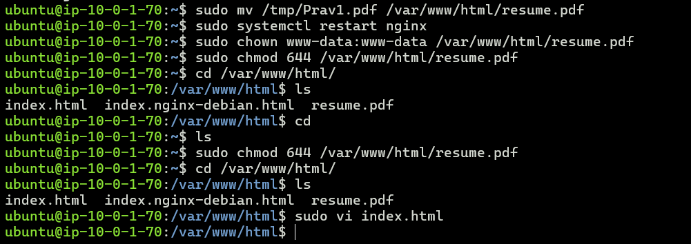
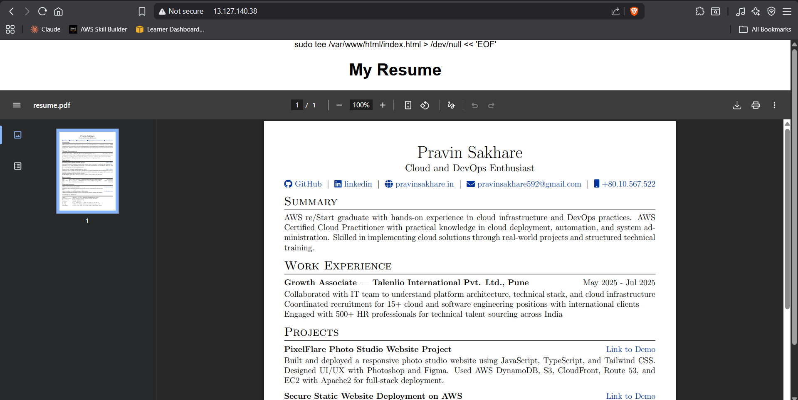

Launch an ec2 instance

 
Name and tags
Name: Pravin_resume-instance
Choose Ubuntu AMI
 

Choose instance type :
 

Select or create the key pair if you don’t have
 

Now select the Vpc that you created and select public subnet 1

click on create security gruop

in inbound rule add http and ssh anywhere

In user data add script to install and setup nginx 

#!/bin/bash

# Update & upgrade system
apt-get update -y
apt-get upgrade -y

# Install nginx
apt-get install -y nginx

# Enable & start nginx
systemctl enable nginx
systemctl start nginx

# Create placeholder HTML page (you will replace this later)
cat <<EOF > /var/www/html/index.html
<!DOCTYPE html>
<html>
<head>
  <title>My Resume Website</title>
</head>
<body>
  <h1>Welcome to My Resume Website</h1>
  
Resume will be uploaded here soon.

</body>
</html>
EOF

# Set correct permissions
chown www-data:www-data /var/www/html/index.html
chmod 644 /var/www/html/index.html

# Basic hardening
sed -i 's/^#\?PermitRootLogin.*/PermitRootLogin no/' /etc/ssh/sshd_config
sed -i 's/^#\?PasswordAuthentication.*/PasswordAuthentication no/' /etc/ssh/sshd_config

systemctl restart sshd

after launching the ec2 instance : instance summary:

Now connect the ec2 instance via ssh into your terminal 

Go to the directory where your private key is downloaded to connect ec2 in my case it is donloads

now next step is copy your resume from local to your ex2 instance for that open new powershell terminal 

and paste this following command and reploace your pem key and resume path

on your windowns powershell run:
scp -i "C:\Users\pravi\Downloads\Asia-keypair.pem" "C:\Users\pravi\Downloads\Prav1.pdf" ubuntu@13.127.140.38:/tmp/Prav1.pdf

now ssh into your ubuntu system:
ssh -i "C:\Users\pravi\Downloads\Asia-keypair.pem" ubuntu@13.127.140.38

Now when inside EC2:

sudo mv /tmp/Prav1.pdf /var/www/html/resume.pdf
sudo systemctl restart nginx

Now give permission to your Resume.pdf file

Give correct permissions:

sudo chown www-data:www-data /var/www/html/resume.pdf
sudo chmod 644 /var/www/html/resume.pdf

STEP 3 — Replace your index.html so it shows your resume

Run:

sudo tee /var/www/html/index.html > /dev/null << 'EOF'
<!DOCTYPE html>
<html>
<head>
  <title>Pravin Sakhare - Resume</title>
  
</head>
<body>
  <h1>My Resume</h1>
  <embed src="resume.pdf" type="application/pdf">
</body>
</html>
EOF

This will make your website load your PDF directly.

Now you can see that your website is live on port 80:

http://13.127.140.38/80
