High Availability + Auto ScalingTask
Enhance your architecture by migrating to a highly available setup:

1. Create an Internet-facing Application Load Balancer (ALB)
2. Migrate the EC2 instance setup to private subnets
3. Create an Auto Scaling Group (ASG) for high availability across AZs
4. Attach the ALB to the ASG
5. Ensure proper routing (public → ALB → private EC2 instances)

Deliverables
1. Brief explanation of your HA architecture and traffic flow
2. Screenshots of:
a) ALB configuration
b) Target group
c) Auto Scaling Group
d) EC2 instances launched via ASG
3. GitHub link to your Terraform/CloudFormation code
*

Step1 : Prep — upload resume to S3
bucket name should be globally unique

block all public access:

Now upload your resume pdf here in bucket :

Why: keeping file in S3 lets all ASG instances download the resume on boot without manual SCP.

Step 2:

(1) Create IAM role for EC2 (via Console)

Goal: allow instances to read the S3 object and use Session Manager (no SSH required).

Steps:

Go to IAM → Roles → Create role.
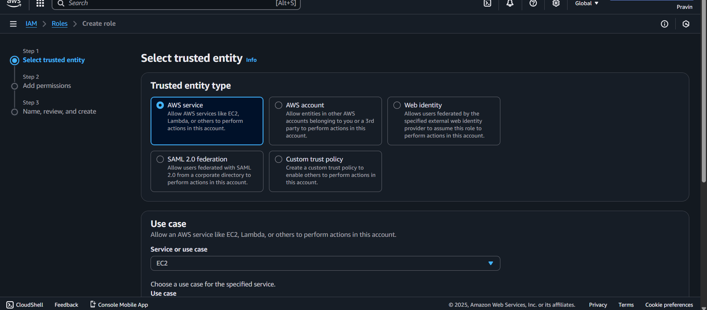

Choose AWS service → EC2 → Next.

Attach managed policy: AmazonSSMManagedInstanceCore.
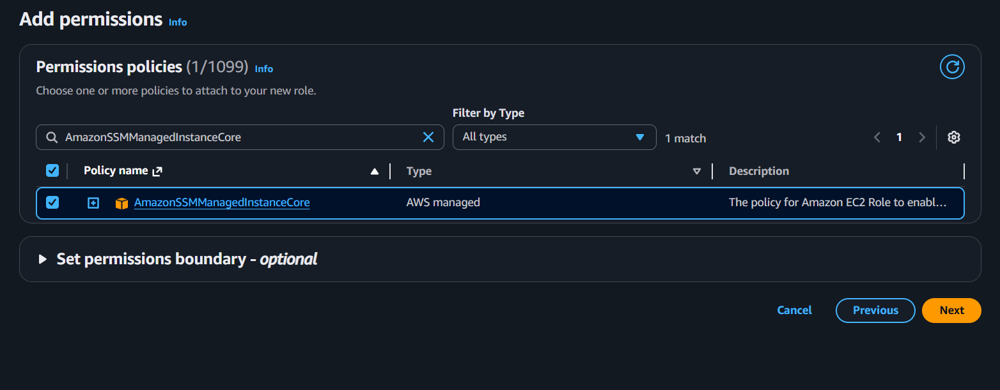

click on create role with given proper name and description:

Click Create inline policy (Policy editor opens in new tab):

Select JSON and paste:
{
  "Version": "2012-10-17",
  "Statement": [
    {
      "Effect": "Allow",
      "Action": "s3:GetObject",
      "Resource": "arn:aws:s3:::pravin-sakhare-resume-bucket/Prav1.pdf"
    }
  ]
}

now review and create the policy:

now create target group: 

4. Register Targets (Skip this)

📌 Important:

DO NOT add any instance now

Auto Scaling Group will attach instances automatically

click on create target group:
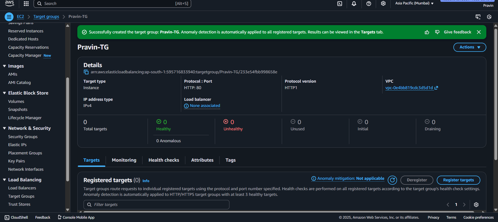

now we will create the application load balancer
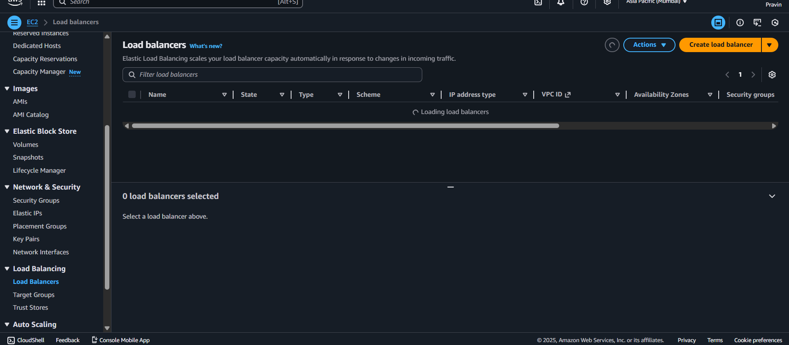

click on create application load balancer:

In networking select your two public subnet:

🔶 5. Configure Listener

There should be a default listener:

HTTP : 80

Choose Forward to:
Pravin-TG

(This is the target group you created)

🎉 ALB is created!

Your ALB will show:

Status: provisioning → active within ~2 minutes

Perfect — now we create the Launch Template, which defines:

AMI (Ubuntu)
 # Select the instance type and key pair
Instance type

IAM role (to read S3 + SSM)

🔶 7. IAM Instance Profile

Scroll → find:

IAM instance profile

Select:

Pravin-InstanceRole
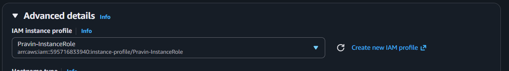

Security group (Instance-SG)

User data script (install Nginx + pull resume from S3)
#!/bin/bash
set -euo pipefail
apt-get update -y
DEBIAN_FRONTEND=noninteractive apt-get -y upgrade
apt-get install -y nginx awscli
systemctl enable nginx
systemctl start nginx

# Download resume from S3 (instance role grants access)
aws s3 cp s3://pravin-sakhare-resume-bucket/Prav1.pdf /var/www/html/resume.pdf || true

# Create index.html embedding PDF
cat > /var/www/html/index.html <<'EOF'
<!doctype html>
<html><head><meta charset="utf-8"><title>Resume</title></head><body style="margin:0">
<h1 style="text-align:center">Pravin Sakhare — Resume</h1>

<embed src="resume.pdf" type="application/pdf" width="100%" height="100%">

</body></html>
EOF

chown -R www-data:www-data /var/www/html
chmod 644 /var/www/html/resume.pdf || true

Make sure:
✔ Bucket name = pravin-sakhare-resume-bucket
✔ File name = Prav1.pdf

🔶 9. Create the Launch Template

Scroll down → click:

Create launch template

launch tamplate created:
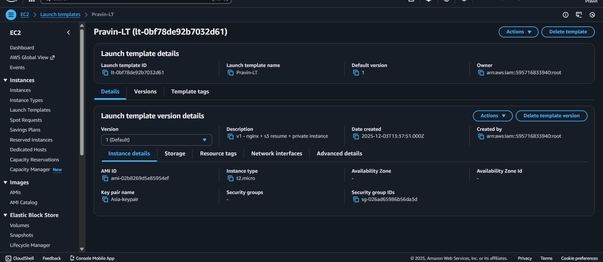

Private subnet behavior (assigned by ASG later)

This template will be used by the Auto Scaling Group.

✅ STEP 6 — Create Auto Scaling Group (ASG)
🔶 1. Go to ASG section

Open EC2 Console

Left menu → Auto Scaling

Click Auto Scaling Groups

Click Create Auto Scaling group

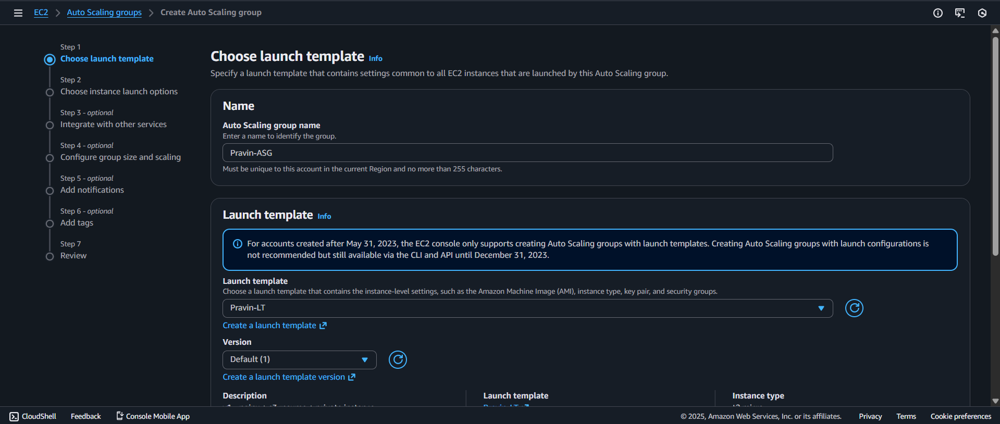
🔶 2. Choose Launch Template

On the first page:

Auto Scaling group name:

Pravin-ASG

Launch Template:
Select:

Pravin-LT

in network setting choose your vpc and private subnet only:
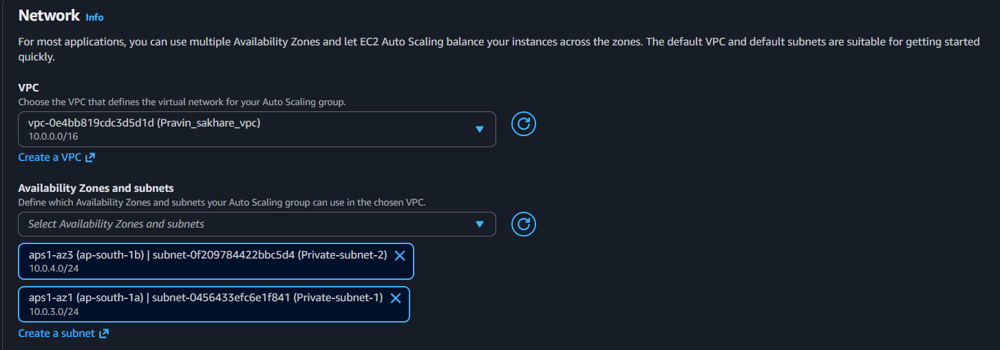

now attach load balancer 

configuration gruop size and policies:
🔶 5. Configure Group Size

Set:

Desired capacity:

2

Minimum capacity:

2

Maximum capacity:

4

Why?

This ensures:

High availability

One EC2 in each private subnet

ASG can scale up to 4 if needed

Click Next.

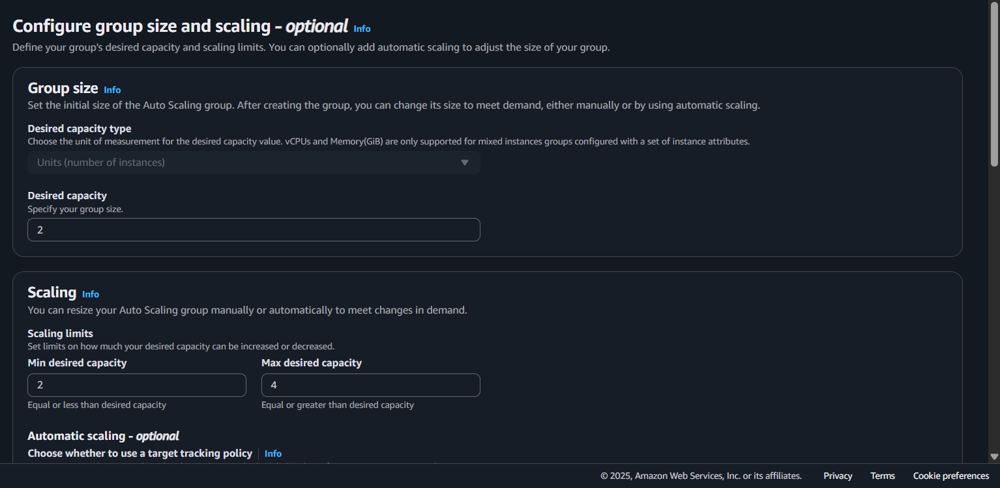

add tag:
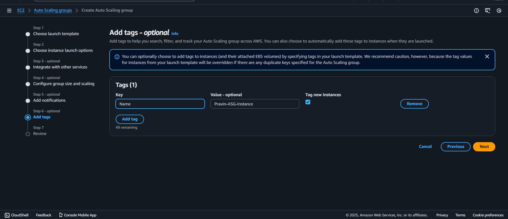

Auto scaling group created:
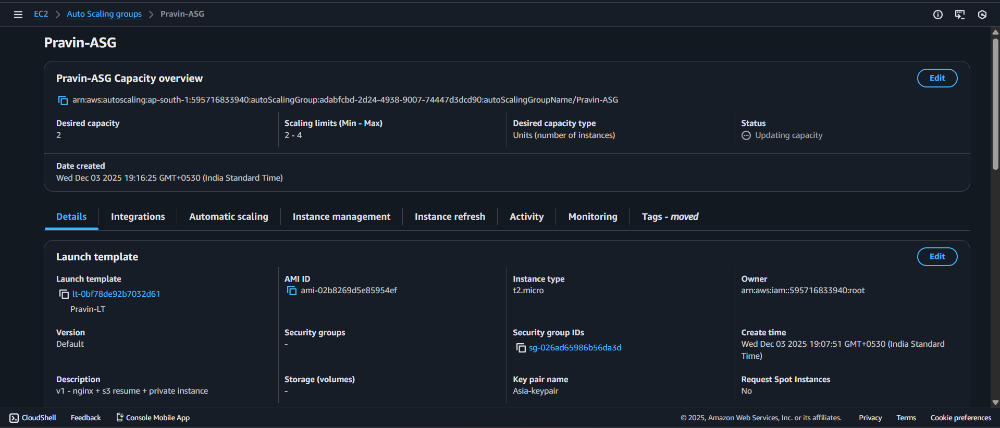

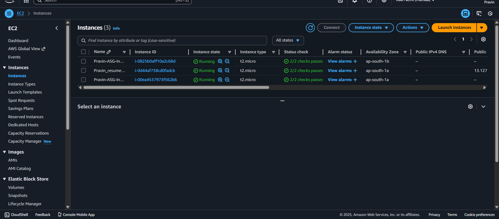