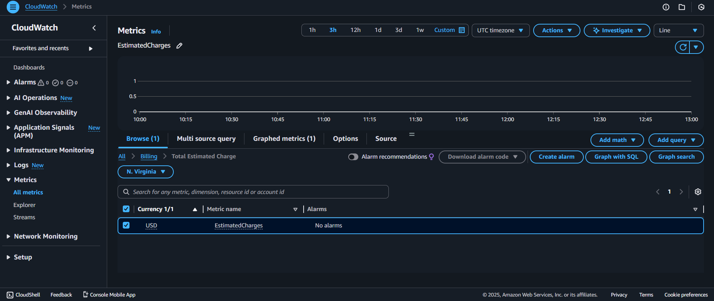
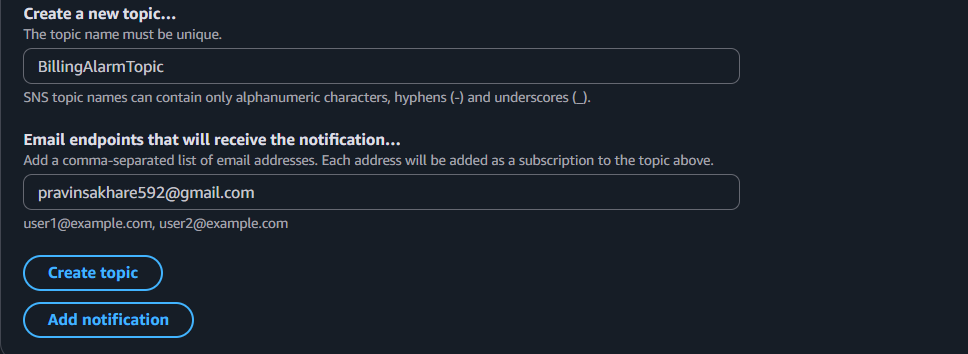
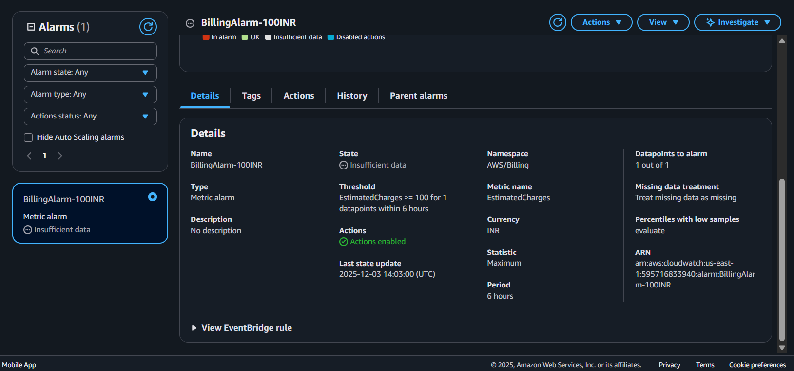

✅ STEP 1 — Enable Billing Alerts (Global setting)

Billing alerts are NOT enabled by default, so do this first:

Go to AWS console

Top-right → click your account name → Billing Dashboard

Left menu → Billing preferences

Enable these checkboxes:

✔ Receive CloudWatch billing alerts
✔ Receive Free Tier usage alerts
✔ Receive text/email alerts for bills

Enter your email address

Click Save preferences

Left menu → Billing preferences

Enable these checkboxes:

✔ Receive CloudWatch billing alerts
✔ Receive Free Tier usage alerts
✔ Receive text/email alerts for bills

Enter your email address

Click Save preferences

✅ STEP 2 — Create a CloudWatch Billing Alarm (₹100 threshold)
Important:

Billing alarms only work in us-east-1 (N. Virginia), so make sure CloudWatch region is that.
1. Go to CloudWatch

Open AWS Console → Services → CloudWatch

Top-right: Set region = N. Virginia (us-east-1)

2. Open Billing Metrics

Left menu:

Metrics

Choose Billing

Click Total Estimated Charge

3. Select Currency

Choose the metric:

EstimatedCharges

Dimension: Currency = INR

4. Create Alarm

Click Actions → Create Alarm

after that:
5. Set Threshold

Threshold type: Static

Condition:

Greater than or equal to: 100

(This means ₹100 INR)

6. Set Notification

Notification type: Email

Create SNS topic (if not created):

Topic name:BillingAlarmTopic

name the alarm:

click on create alarm:

After creating an alarm you can see like this:

